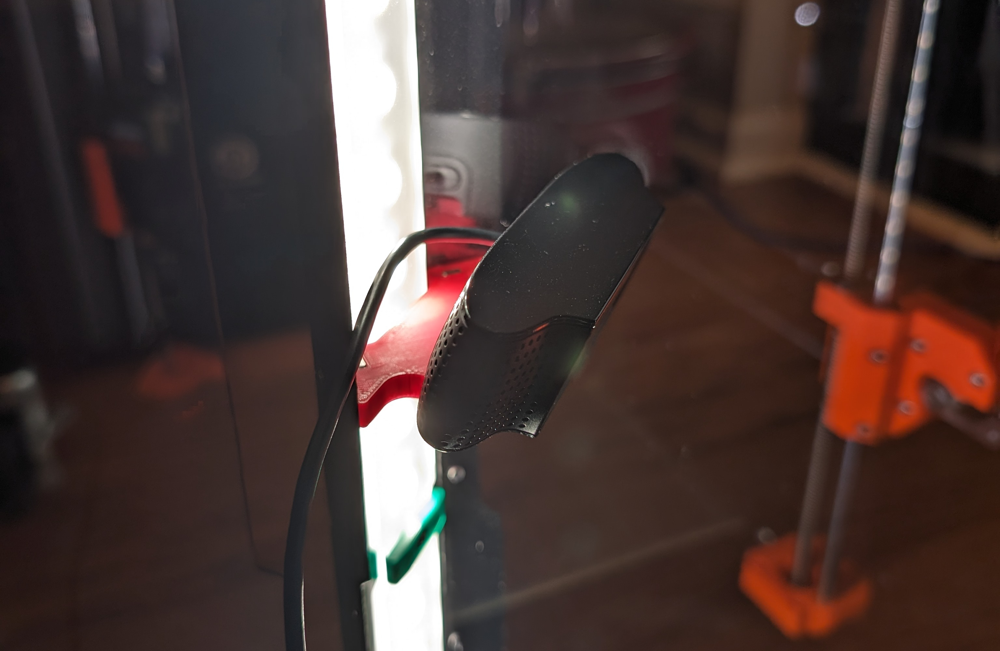
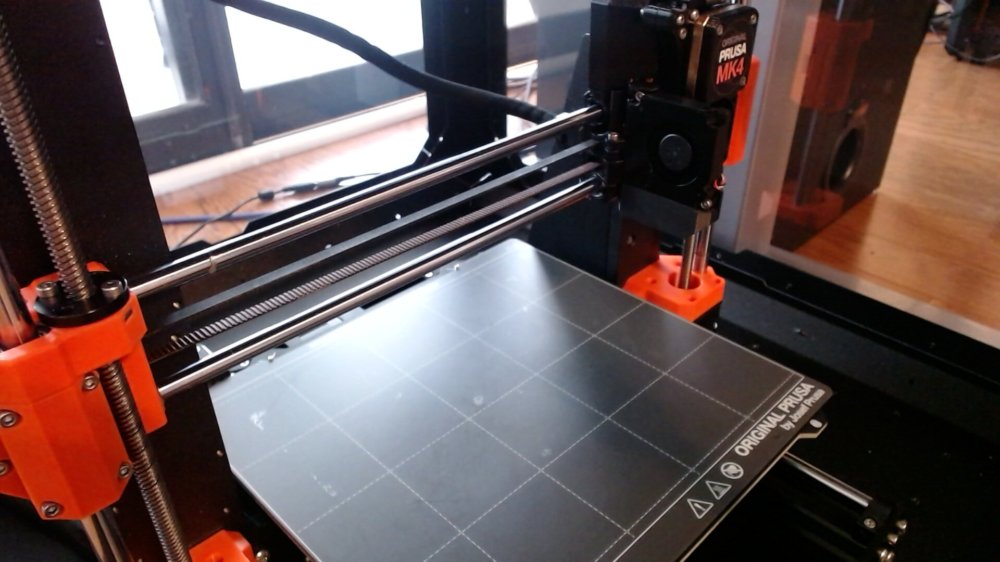

# prusa-cam

I set up a Logitech C920 webcam [inside my Prusa enclosure](https://www.printables.com/model/433908-logitech-c920-original-prusa-enclosure-mount) to be able to monitor my prints using Prusa Connect. `prusa-cam` is a Bash script that POSTs snapshots from your webcam to the Prusa Connect API in 10 second intervals, which I believe is the minimum time generally allowed by Prusa. It only sends snapshots when your printer is online and actively printing. It pings your printer locally and runs as a systemd service, and logs if things are successful or not, resetting states if failures occur.

## Dependencies

- curl
- jq
- v4l2-ctl
- ffmpeg

## Setup

- Copy `prusa-cam` to somewhere like `"$HOME/.local/bin/"`
- Copy the systemd service to `"$HOME/.config/systemd/user/"`
- Edit the systemd service with the full path to the script
- Copy `env.example` to `"$HOME/.config/prusa-cam/env"`
- Edit the file with your settings
  - Get your printer API key from your printer (PrusaLink API key)
  - Get your camera name from `v4l2-ctl --list-devices`
  - Generate a fingerprint with something like `pwgen 32 1 | base64`
  - Get your token from Prusa Connect > Camera > Other cameras
- Run `prusa-cam`, ensure you're getting successes
  - Note: `prusa-cam` will only start POSTing snapshots if your printer is actively printing
  - `prusa-cam` will let you know if one of the critical dependencies is missing, or if your config is missing required fields
- Run `systemctl --user enable --now prusa-cam`
